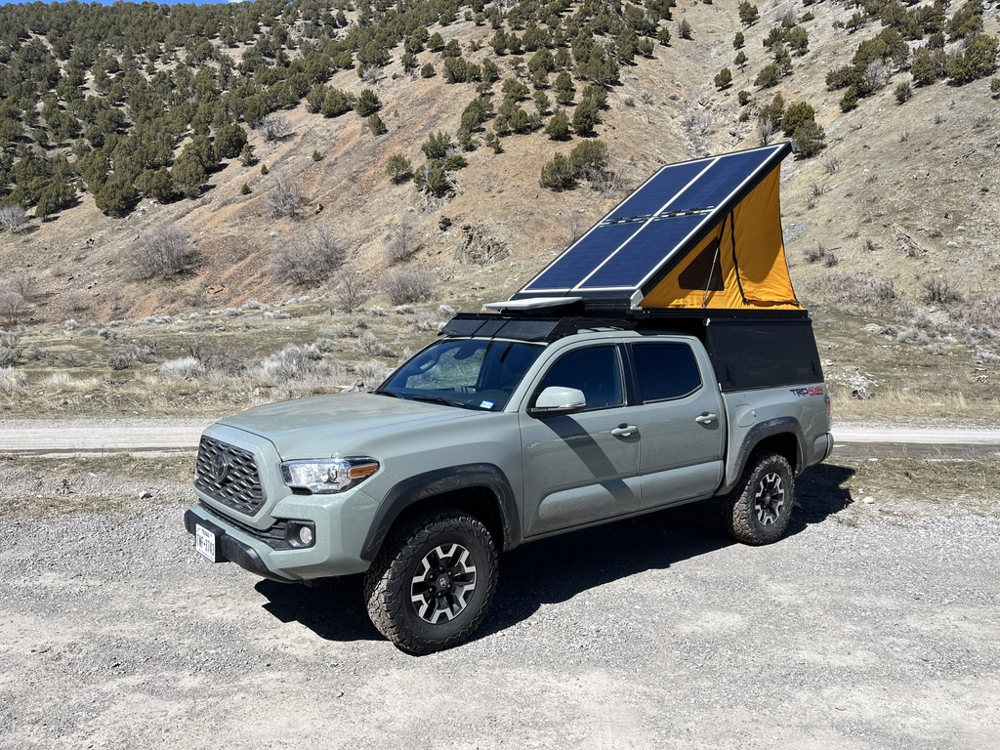
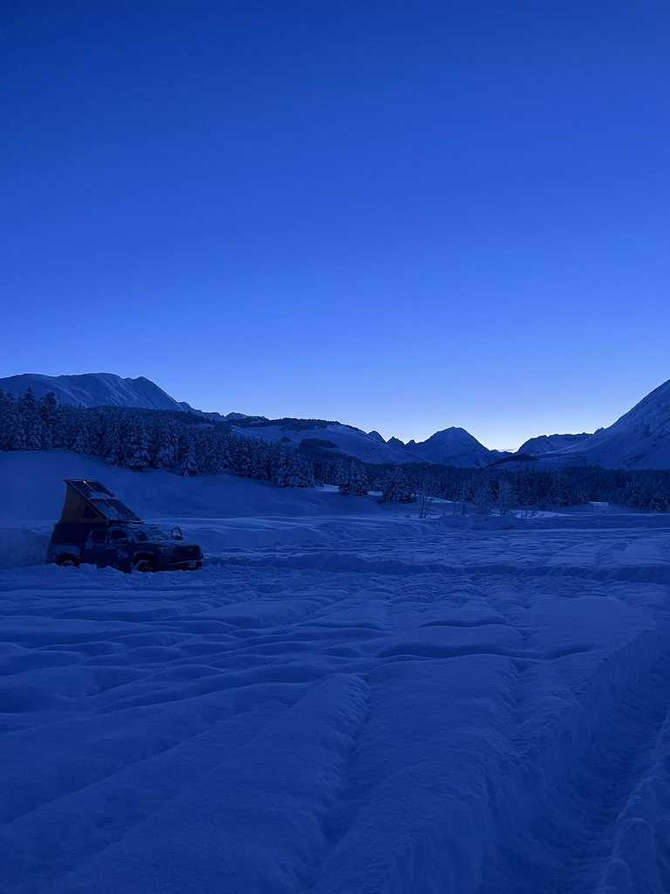
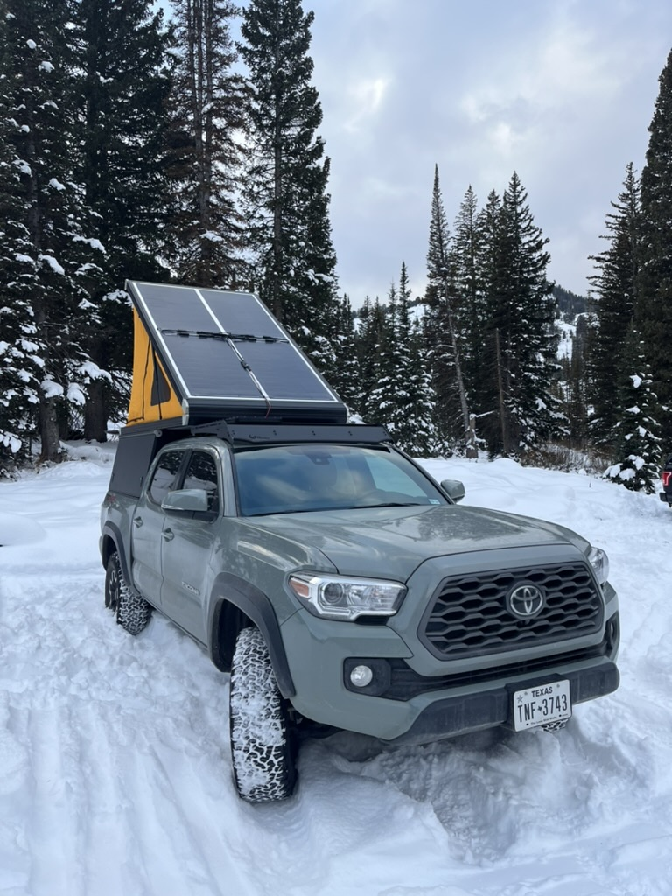

# Steezemobile

## Why steezemobile?

Steezemobile is a truck. [steezeman](https://github.com/steezeman) lives in it from time to time. It's a 2022 Toyota
Tacoma capable of going off-grid for long periods of time and supporting a guy trying to live the life of a granola
crunching ski bum, and a homeless embedded engineer.

## Why not a van? Why not a bigger truck?

Because vans are big, expensive, trendy, and can't get as deep into the middle of nowhere as I want to

A bigger truck would help free me from weight and volume constraints, but the Tacoma has proven to be the best platform
to balance dimensions, cost, efficiency, manuverability, etc. It's a small space, and it's most certainly not for most.

## Modification List

| Name                                               | Description                                         |
|----------------------------------------------------|-----------------------------------------------------|
| [Batteries + Charging](docs/BATTERIES_CHARGING.md) | LiFePo4 battery bank, solar and alternator charging |
| Automation                                         |                                                     |

## Photo gallery

