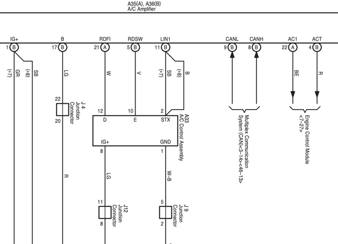

# Climate Control

AC1 - commands the Engine ECU to idle higher to support A/C compressor. When pulled to ground, high idle is active
ACT - signal back from Engine ECU to ACK AC1 status

I am overriding the AC Amplifier by pulling AC1 to ground through a 120 ohm resistor when I need high idle. The Raspberry Pi with sequent microsystems 
Home Automation HAT manages this.

Plans:
- Reverse engineer the LIN protocol between A/C amplifier LIN1 and A/C control assembly to allow 

LIN Commands
ID 31 
Length 8
This is the status register

ID 39
This is the command register. It sets bits when buttons are pressed

ID 32
Seems constant, might be for an error message

MODE:
Changes ID 31, byte 3.
Byte 2 is 0bXXXX0001 head only
Byte 2 is 0bXXXX0010 head and feet
Byte 2 is 0bXXXX0011 feet
Byte 2 is 0bXXXX0100 feet and defrost

Recirc:
Byte 2 Bit 5 is recirc (active: 1)

A/C
Byte 2 Bit 7 is A/C (active: 1)

Defrost
Byte 2 bit 3 is Defrost (active:1) - but there's a lot of interactions with this

Byte 1 bit 1 is Auto

Temp settings
LO is byte 4 and 5 at 0x00
60 F is at 0x66
...
64 F is at 0x6A
65 F is at 0x22
...
HI is at 0x37
When AC is OFF, 0x38 is sent for both temps

Fan levels
Byte 1 lower nibble @ 0 gives OFF
...
Byte 1 lower nibble @ 7 gives FULL ON

SYNC
Byte 3 bit 1 gives SYNC

OFF message (HEX)
00 00 03 00 38 38 00 80

ON example (HEX)
00 27 A1 20 00 00 00 80

 Last byte is always 0x80, second to last is always 00

FOR 0x39::::: this is the button press register

TO TURN ON AC
Set 4th bit of 0th byte to look like a button press (AUTO)

Bytes 4 and 5 are the dials for temp - if positive, top nibble is 1, negative zero. Lower nibble is magnitude, zero to F
Byte 2 is fan speed - if positive, top nibble is 3, negative, top is 2. Lower nibble is same as in temp

Defrost button is MSbit of byte 3 
AC is bit 6 of byte 1
Recirc sets byte 7 to 0xC0
Off is Bit 1 of byte 0
Sync is bit 5 of byte 3

UNANSWERED QUESTIONS:
Can I get away without RDFI and RDSW???